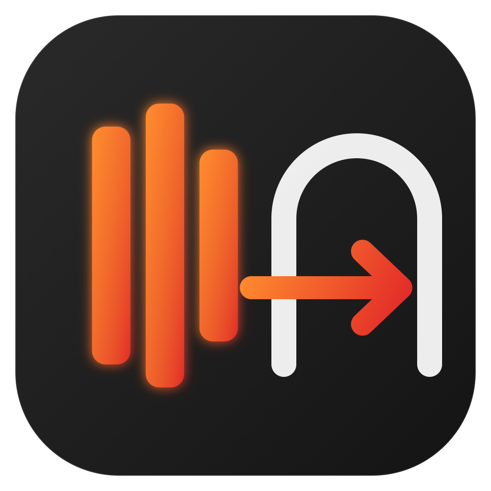

<p align="center">
  
</p>

# Unraid Drive

**Your Unraid shares in the Files app on iPhone, iPad and Apple Vision Pro — at home or on 5G, no VPN.**

Unraid Drive is a native SwiftUI app with a **File Provider extension**: your Unraid shares appear in the Files app next to iCloud Drive, so every app that can open the Files picker can read and write files on your NAS. A small read-only dashboard shows the array, shares, Docker containers and notifications.

It talks to [`unraid-gateway`](https://github.com/sidimam/unraid-gateway), a 10 MB container running on Unraid that authenticates with your **Unraid API key**, serves the shares you choose, and proxies the Unraid GraphQL API.

📖 **Setup guide, step by step: the [Wiki](https://github.com/sidimam/unraid-drive/wiki).**

| | | |
|---|---|---|
|  |  |  |

## Features

- **Files app integration** through `NSFileProviderReplicatedExtension`: browse, open, save, move, rename, delete; on-demand download; resumable chunked uploads; background change detection via the gateway change feed.
- **Works anywhere**: publish the gateway with Cloudflare Tunnel (no port forwarding, works behind CGNAT) or any reverse proxy with a valid certificate.
- **Two connection modes**: direct HTTPS, or **Cloudflare Access** with a service token (`CF-Access-Client-Id` / `CF-Access-Client-Secret`), like Unraid Deck. Both fields accept the lines exactly as copied from the Cloudflare dashboard.
- **Per-user access**: add your Unraid username and password and the gateway applies your SMB share permissions (public / secure / private, read and write lists), verified by Unraid's Samba. Read-only shares are read-only in the Files app too.
- **Dashboard** fed by the Unraid API: system info, CPU/memory load, notifications, array state and usage, parity check, disk temperatures, share usage, containers with update badges and Web UI links.
- **Demo mode**: a built-in sample server that works offline, in the app and in the Files app. Handy for App Store review and for trying the app before installing the container.
- **Walkthrough** on first launch, re-openable with **?**.
- **Secrets in the Keychain**, shared only with the extension. No analytics, no third-party servers.
- **Optional iCloud sync** (Settings): the server list goes to iCloud Key-Value Storage and the secrets to iCloud Keychain (end-to-end encrypted), so a restored or new iPhone finds its configuration. Off by default; a restore banner appears when iCloud holds a configuration and the device has none.
- **Connection test** with five checks (reachability, key, shares, write probe, Files location) and **edit server** without losing the Files app location.
- **Universal**: iPhone, iPad and native visionOS from one codebase.

## Project layout

```
UnraidDrive/
├── project.yml                  XcodeGen spec (run `xcodegen generate`)
├── App/                         SwiftUI app (servers, dashboard, browser, walkthrough)
├── FileProvider/                File Provider extension (items, enumerators, stable ID index)
├── Packages/UnraidGatewayKit/   Shared Swift package: gateway client, models, Keychain,
│                                dashboard query, offline demo gateway (URLProtocol)
├── Screenshots/                 App Store screenshots (iPhone 6.9", iPad 13", visionOS)
└── wiki/                        Source of the GitHub wiki pages
```

## Build

Requirements: Xcode 26, [XcodeGen](https://github.com/yonaskolb/XcodeGen) (`brew install xcodegen`).

```bash
xcodegen generate
open UnraidDrive.xcodeproj
```

Set your team in `project.yml` (`DEVELOPMENT_TEAM`) and change the bundle identifier prefix and the app group (`group.com.sdimambro.unraid-drive` in `project.yml` and `AppGroup.identifier`) if you fork.

Command line:

```bash
xcodebuild -project UnraidDrive.xcodeproj -scheme UnraidDrive \
  -destination 'platform=iOS Simulator,name=iPhone 17 Pro' build
xcodebuild -project UnraidDrive.xcodeproj -scheme UnraidDrive \
  -destination 'generic/platform=visionOS Simulator' build
cd Packages/UnraidGatewayKit && swift test
```

Launch argument `-openServer` opens the first configured server directly (used for screenshot automation).

## How the File Provider works

- Items are addressed on the gateway by **path**; the extension keeps a small persistent index mapping stable UUID identifiers to paths so renames and moves keep their identity.
- The **root** lists the mounted shares (read-only level); shares cannot be renamed or deleted; inside a share everything is allowed.
- **Change tracking** uses `GET /fs/changes` with the paginated `since`/`after` cursor encoded in the sync anchor; deletions are detected by re-listing changed directories against the last known listing.
- Uploads above 16 MB use the gateway's resumable protocol in 8 MB chunks (also keeps every request under Cloudflare's 100 MB body limit).

## Roadmap

- [ ] macOS (File Provider for Finder)
- [ ] Thumbnails via a gateway endpoint
- [ ] Container start/stop from the dashboard (ADMIN key)
- [ ] Per-share read-only flag surfaced in the UI
- [ ] Localisation (Italian first)

## Privacy

No analytics, no accounts, no developer servers: see [PRIVACY.md](PRIVACY.md) (also published at https://sidimam.github.io/unraid-drive/).

## License

MIT — see [LICENSE](LICENSE). Not affiliated with Lime Technology / Unraid; the icon is an original design.
