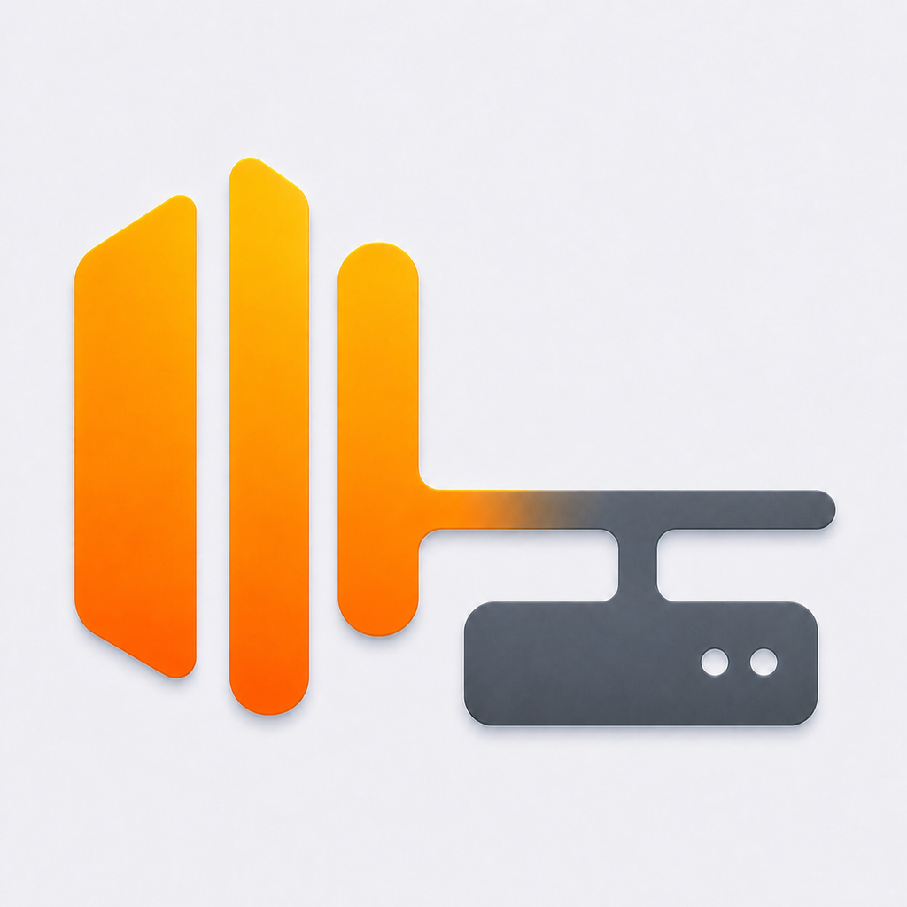
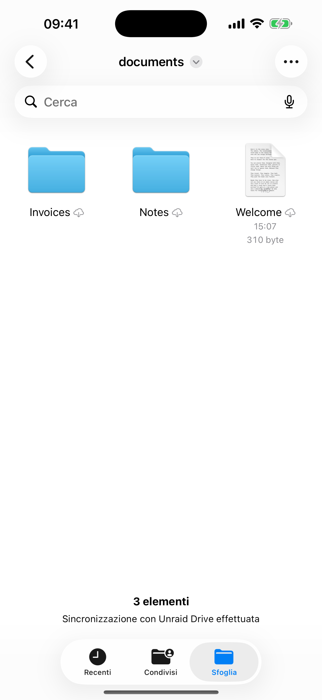
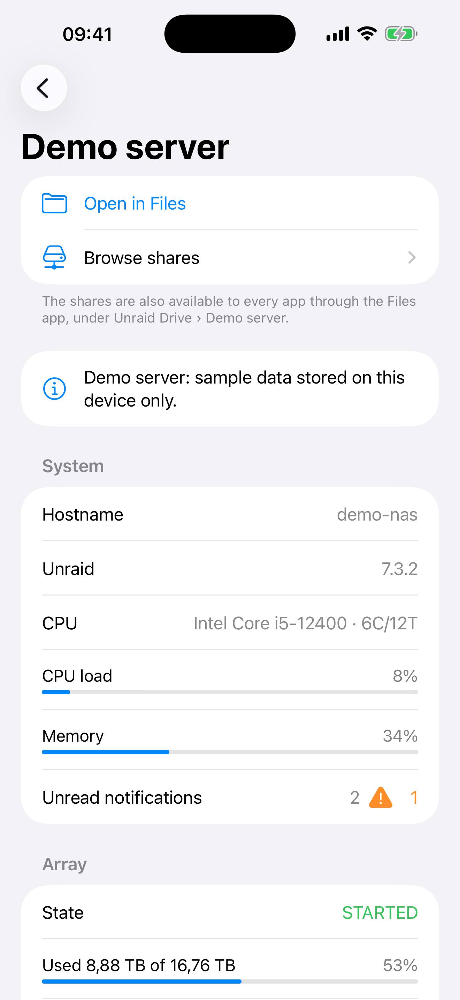
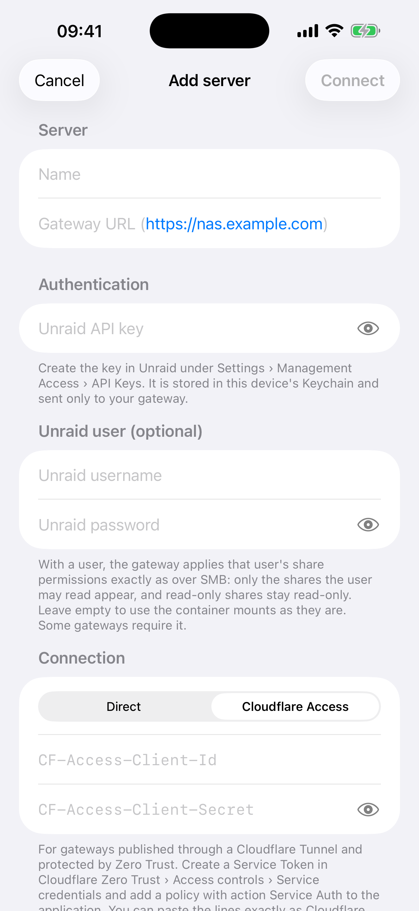

<p align="center">
  
</p>

# Unraid Drive

**Your Unraid shares in the Files app on iPhone, iPad and Apple Vision Pro, and in the Finder on the Mac — at home or on 5G, no VPN.**

Unraid Drive is a native SwiftUI app with a **File Provider extension**: your Unraid shares appear in the Files app next to iCloud Drive, so every app that can open the Files picker can read and write files on your NAS. A small read-only dashboard shows the array, shares, the gateway container and notifications.

It talks to [`unraid-gateway`](https://github.com/sidimam/unraid-gateway), a 10 MB container running on Unraid that authenticates with your **Unraid API key**, serves the shares you choose, and proxies the Unraid GraphQL API.

📖 **Setup guide, step by step: the [Wiki](https://github.com/sidimam/unraid-drive/wiki).**

## Download

[](https://apps.apple.com/app/id6809862123)
[](https://github.com/sidimam/unraid-drive/releases/latest/download/Unraid-Drive-macOS.dmg)
[](https://github.com/sidimam/homebrew-tap)
[](CHANGELOG.md)

- **App Store** (universal purchase): iPhone, iPad, Apple Vision Pro and Mac — version 1.1 in review, 1.0 live on visionOS.
- **Mac DMG**: Developer ID signed and notarized, from the [latest GitHub release](https://github.com/sidimam/unraid-drive/releases/latest).
- **Homebrew**: `brew install --cask sidimam/tap/unraid-drive`, update with `brew upgrade --cask unraid-drive`.
- **Server**: [unraid-gateway](https://github.com/sidimam/unraid-gateway) container (Community Applications) or `brew install sidimam/tap/unraid-gateway`.

| | | |
|---|---|---|
|  |  |  |

## Features

- **Files app integration** through `NSFileProviderReplicatedExtension`: browse, open, save, move, rename, delete; on-demand download; resumable chunked uploads; background change detection via the gateway change feed.
- **Works anywhere**: publish the gateway with Cloudflare Tunnel (no port forwarding, works behind CGNAT) or any reverse proxy with a valid certificate.
- **Two connection modes**: direct HTTPS, or **Cloudflare Access** with a service token (`CF-Access-Client-Id` / `CF-Access-Client-Secret`), like Unraid Deck. Both fields accept the lines exactly as copied from the Cloudflare dashboard.
- **Per-user access**: add your Unraid username and password and the gateway applies your SMB share permissions (public / secure / private, read and write lists), verified by Unraid's Samba. Read-only shares are read-only in the Files app too.
- **Dashboard** fed by the Unraid API: system info, CPU/memory load, notifications, array state and usage, parity check, disk temperatures, share usage, and the unraid-gateway container with its update badge (other containers stay in the Unraid web UI).
- **Demo mode**: a built-in sample server that works offline, in the app and in the Files app. Handy for App Store review and for trying the app before installing the container.
- **7 languages**: English, Italian, Spanish, French, German, Simplified Chinese and Arabic (right-to-left). The app follows the device language; Settings has a language picker with a "System" option, plus a System/Light/Dark theme switch.
- **Unraid look**: accent, headers and titles in the Unraid orange (#FF8C2F); the app icon (the Unraid bars feeding a network drive, artwork in `Design/`, distinct from the gateway icon) comes in six colours with light, dark and tinted variants; the chosen **App colour** also tints titles, headers, toggles and the Mac menu bar panel. `scripts/make_icons.py` derives them from the artwork.
- **Sync like the big ones** (gateway 0.5+): items are addressed by the gateway's stable ids and the extension asks the gateway's change journal "what changed since sequence N" instead of walking the shares, so renames, moves and deletions made from anywhere (SMB, other containers, the app) reach the Files app within minutes and identities survive reinstalls. Older gateways still work through the legacy feed.
- **Home Screen quick actions**: long-press the icon for Open the Files app, Test connection, Add server.
- **Shortcuts and Siri** (App Intents, iPhone/iPad/Vision Pro/Mac): *Save clipboard to Unraid Drive* (text → .txt, image → .png, file as is), *Upload file*, *Get file* (returns the file to the next action), *List folder*, *Refresh Unraid Drive locations*, *Test connection*. Phrases in the 7 languages; the actions also appear in Spotlight.
- **Notifications**: the app tells you when a gateway stops answering (and when it is back) and when the Files app / Finder could not upload or download a file (from the extension's activity log). No in-app switches: a *Notifications ›* row opens the system settings.
- **Walkthrough at every update**: features and what's new, iCloud step (restore the configuration found in iCloud, or turn sync on — one backup shared by iPhone, iPad, Vision Pro and Mac), notification permission. Every step can be skipped; iCloud stays available in Settings.
- **Background refresh**: the app wakes its Files locations about once an hour, so a gateway restart (update, nightly backup) does not leave them paused until the next launch.
- **Walkthrough** on first launch, re-openable with **?**.
- **Secrets in the Keychain**, shared only with the extension. No analytics, no third-party servers.
- **Optional iCloud sync** (Settings): the server list goes to iCloud Key-Value Storage and the secrets to iCloud Keychain (end-to-end encrypted), so a restored or new iPhone finds its configuration. Off by default; a restore banner appears when iCloud holds a configuration and the device has none.
- **Connection test** with five checks (reachability, key, shares, write probe, Files location) and **edit server** without losing the Files app location.
- **Choose which shares to show** (1.2): after connecting, in the walkthrough, from Settings › Shares to show or in the server's details, tick the shares you want in Files, the Finder, Shortcuts and on Apple TV. The gateway already limits the list to what your Unraid user may see; this filter is yours, like the folder selection of Google Drive/OneDrive, and travels with the iCloud configuration.
- **Universal**: iPhone, iPad, native visionOS, macOS and Apple TV from one codebase.
- **Apple TV**: media browser through the gateway with the user's own permissions — photos, music and video played natively, dashboard; pairing by a 6-digit code from iPhone/iPad/Mac (credentials travel AES-GCM encrypted through iCloud Key-Value Storage). See [Step 8](https://github.com/sidimam/unraid-drive/wiki/Step-8-Unraid-Drive-on-Apple-TV).
- **On the Mac, like the big cloud drives**: every server is a location in the Finder sidebar (`~/Library/CloudStorage/UnraidDrive-<server>`, files download on demand, the Finder shows the sync badges), with a menu bar panel — Home (open the folder, sync status, pause/resume), Activity (every download, upload, rename and deletion recorded by the extension), Notifications (unread Unraid notifications), and a gear menu with Preferences, Offline files (space used locally, free it up), Error list, About, Launch at login and Quit. The location must be enabled once in System Settings › General › Login Items & Extensions › File Providers; the app shows a banner until it is.

## Install on the Mac

- **Mac App Store** (universal purchase with the iOS app) — when the review is done.
- **Homebrew**: `brew install --cask sidimam/tap/unraid-drive` (installs the same Developer ID signed, notarized DMG from the GitHub Releases into `/Applications`; update with `brew upgrade --cask unraid-drive`).
- **DMG**: download `Unraid-Drive-<version>.dmg` from the [Releases](https://github.com/sidimam/unraid-drive/releases/latest), drag *Unraid Drive* into Applications. Apple Silicon or Intel, macOS 14+.

After the first launch enable the extension under System Settings › General › Login Items & Extensions › File Providers ([Step 7 of the wiki](https://github.com/sidimam/unraid-drive/wiki/Step-7-Unraid-Drive-on-the-Mac)). `scripts/make_dmg.sh` builds, notarizes and staples the DMG.

## What's new

**1.2 (build 22):** choose which shares to show (Files, Finder, Shortcuts, Apple TV); permission errors carry the gateway's explanation (folder, owner, mode, fix; unraid-gateway 0.5.5+). **1.1 (build 20/21):** Shortcuts and Siri actions, notifications when the gateway is unreachable or a file could not sync, walkthrough at every update with iCloud restore, app colour applied to the whole app, Apple TV app. Full history in [CHANGELOG.md](CHANGELOG.md); server side in the [unraid-gateway changelog](https://github.com/sidimam/unraid-gateway/wiki/Changelog).

## Project layout

```
UnraidDrive/
├── project.yml                  XcodeGen spec (run `xcodegen generate`)
├── App/                         SwiftUI app (servers, dashboard, browser, walkthrough)
├── FileProvider/                File Provider extension (items, enumerators, stable ID index,
│                                activity log; macOS: sidebar symbol + extension icon)
├── Packages/UnraidGatewayKit/   Shared Swift package: gateway client, models, Keychain,
│                                dashboard query, offline demo gateway (URLProtocol)
├── Screenshots/                 App Store screenshots (iPhone 6.9", iPad 13", visionOS, Mac)
└── wiki/                        Source of the GitHub wiki pages
```

## Build

Requirements: Xcode 26, [XcodeGen](https://github.com/yonaskolb/XcodeGen) (`brew install xcodegen`).

```bash
xcodegen generate
open UnraidDrive.xcodeproj
```

Set your team in `project.yml` (`DEVELOPMENT_TEAM`) and change the bundle identifier prefix and the app group (`group.com.sdimambro.unraid-drive` in `project.yml` and `AppGroup.identifier`) if you fork.

Command line:

```bash
xcodebuild -project UnraidDrive.xcodeproj -scheme UnraidDrive \
  -destination 'platform=iOS Simulator,name=iPhone 17 Pro' build
xcodebuild -project UnraidDrive.xcodeproj -scheme UnraidDrive \
  -destination 'generic/platform=visionOS Simulator' build
xcodebuild -project UnraidDrive.xcodeproj -scheme UnraidDrive \
  -destination 'platform=macOS' build        # copy "Unraid Drive.app" to ~/Applications to test the Finder location
cd Packages/UnraidGatewayKit && swift test
```

Launch arguments (Debug): `-openServer` opens the first configured server; `-seedDemo` adds the demo server; `-rebuildDomains` re-registers every location; on the Mac `-panelPreview` shows the menu bar panel in a window (screenshots).

## How the File Provider works

- Items are addressed on the gateway by **path**; the extension keeps a small persistent index mapping stable UUID identifiers to paths so renames and moves keep their identity.
- The **root** lists the mounted shares (read-only level); shares cannot be renamed or deleted; inside a share everything is allowed.
- **Change tracking** uses `GET /fs/changes` with the paginated `since`/`after` cursor encoded in the sync anchor; deletions are detected by re-listing changed directories against the last known listing.
- Uploads above 16 MB use the gateway's resumable protocol in 8 MB chunks (also keeps every request under Cloudflare's 100 MB body limit).

## Roadmap

- [x] macOS (File Provider for Finder, menu bar panel)
- [ ] Thumbnails via a gateway endpoint
- [ ] Container start/stop from the dashboard (ADMIN key)
- [ ] Per-share read-only flag surfaced in the UI
- [ ] Localisation (Italian first)

## Privacy

No analytics, no accounts, no developer servers: see [PRIVACY.md](PRIVACY.md) (also published at https://sidimam.github.io/unraid-drive/).

## License

MIT — see [LICENSE](LICENSE). Not affiliated with Lime Technology / Unraid; the icon is an original design.

## Release

`scripts/release.sh` archives, exports and uploads the iOS, visionOS and macOS builds to TestFlight (`PLATFORMS="macOS"` to restrict); `scripts/make_dmg.sh` produces the Developer ID DMG for GitHub Releases and the Homebrew cask (needs `ASC_ISSUER` in the environment and the App Store Connect API key in `~/.appstoreconnect/private_keys/`). `AppStore/store_meta.py` holds the localized App Store listing texts.
